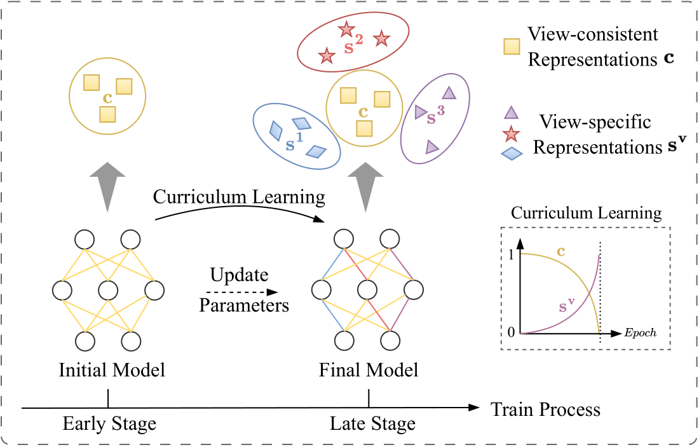
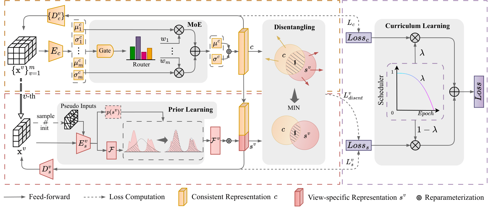

PyTorch implementation for the paper "Disentangling Multi-view Representations via Curriculum Learning with Learnable Prior" (IJCAI 2025)

<!--  -->


## Requirements 
* python == 3.10.15
* torch == 2.1.0
* torchvision == 0.16.0
* scikit-learn == 1.5.2
* scipy == 1.14.1

We also export our conda virtual environment as CL2P.yaml. You can use the following command to create the environment.
```bash
conda env create -f CL2P.yaml
```

## Dataset and model
You could find the Office-31 dataset we used in the paper from [Baidu Netdisk](https://pan.baidu.com/s/1lcE6gEwuO0k1nR_m17gtKw?pwd=hwvx), and the pre-trained models from [Baidu Netdisk](https://pan.baidu.com/s/10FRHrgtLhAE08ENblP4vsg?pwd=3utf).

## Usage
### Training
To train the model, use the following command:

```bash
python train.py -f configs/Edge-MNIST.yaml
```
This will start the training process using the configuration specified in `configs/Edge-MNIST.yaml`.

### Testing
To test the trained model, use the following command:
```bash
python test.py -f configs/Edge-MNIST.yaml
```
This will load the trained model and test it using the configuration specified in `configs/Edge-MNIST.yaml`.

## Citation
If you find CL2P useful in your research, please consider citing:
```latex
@inproceedings{guo2025cl2p,
  title={Disentangling Multi-view Representations via Curriculum Learning with Learnable Prior},
  author={Guo, Kai and Wang, Jiedong and Peng, Xi and Hu, Peng and Wang, Hao},
  journal={Proceedings of the 34th International Joint Conference on Artificial Intelligence},
  year={2025}
}
```